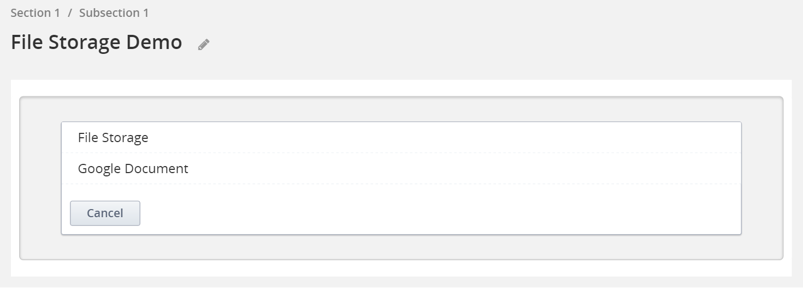
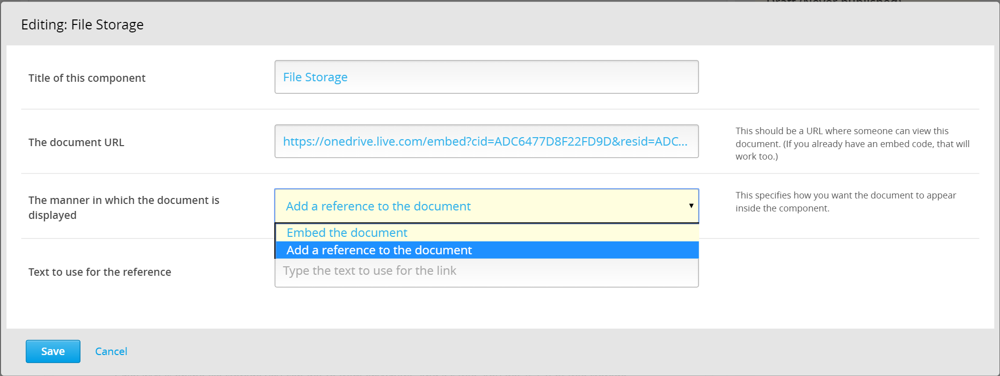
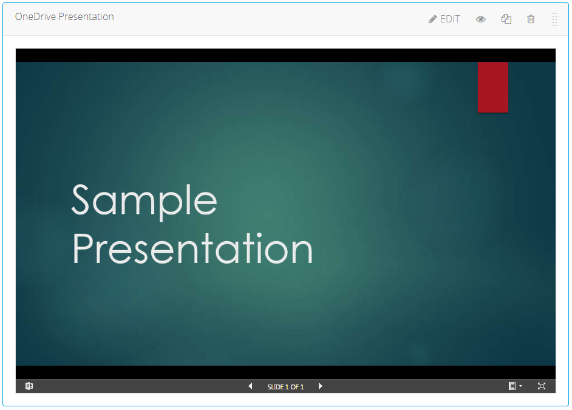

File Storage XBlock
===================

The “File Storage XBlock” allows course staffers to add One Drive for Business (ODB) files to the courseware (courseware, course info and syllabus) by adding a link through an advanced component that they create in edX’s Studio authoring tool.

Students will view these ODB files natively on their Open edX or edX.org courses. 

Installation
------------
To install the File Storage XBlock within your edX Python environment, run the following command:

```bash
$ pip install /path/to/xblock-file-storage/
```

Enabling in Studio
------------------

To enable the File Storage XBlock within studio:

1. Navigate to `Settings -> Advanced Settings` from the top nav bar.
2. Add `"filestorage"` to the Advanced Module List, as shown in the screen shot below.


Usage
-----
Once enabled in Studio, it's easy to use the File Storage XBlock.

Start by navigating to the unit in studio where you want to insert your OneDrive for Business file. From here choose the `Advanced` component.


This will bring up a list of the XBlocks that have been enabled in Studio. If you followed the previous step to enable the File Storage XBlock in Studio you will see an option titled `File Storage`. Click on it to insert the File Storage XBlock into your unit.



After you've inserted the File Storage XBlock, a default OneDrive for Business Document will be inserted into your unit as shown in the screen shot below.


To change the inserted XBlock click on the `Edit` button on the upper-right corner of the File Storage XBlock. This will bring up the edit dialog where you can change the display name of the component as well as the OneDrive for Business document that is being inserted.



Update the component name to the text you want to be displayed.

You will be able to:

- Insert a document link from a OneDrive file. The "File Storage" Xblock will automatically select the right format.
- Insert a download link to any file. 
- Insert an embed code. Note that the embed code has priority over the document link.

After you click save, your File Storage XBlock will have been updated with the new values.



At this point simply click on the `Publish` button and the OneDrive for Business document will be available for students to view it from the LMS.


