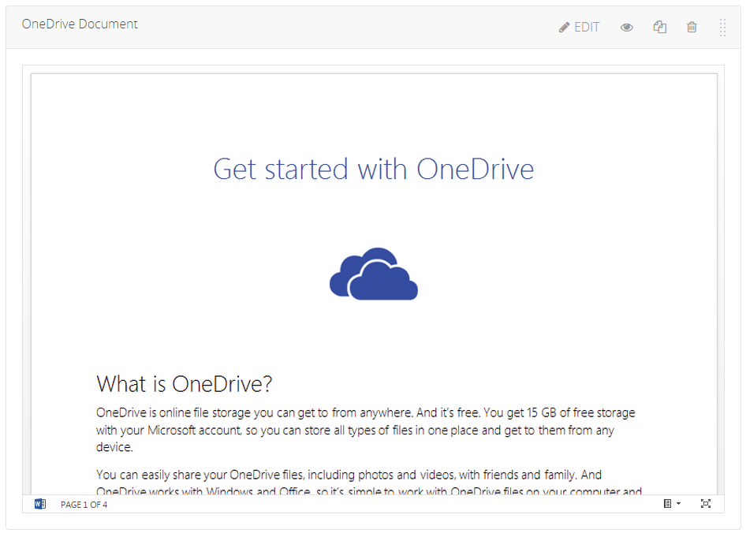
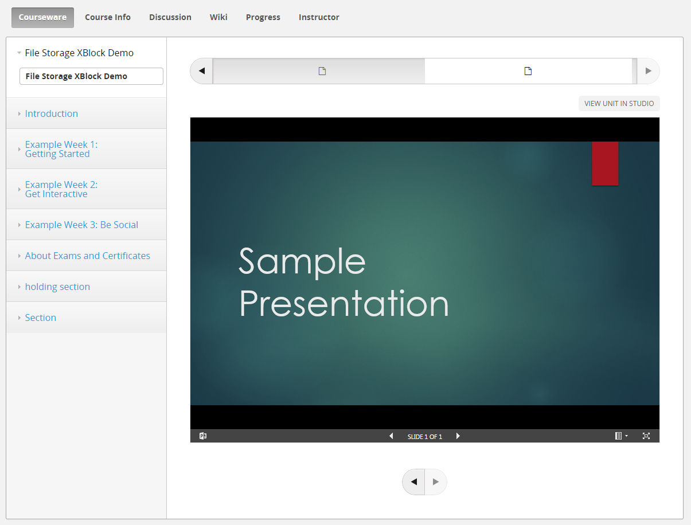

File Storage XBlock
===================

The “File Storage XBlock” allows course content authors to add files stored in various internet file storage services to the course. The files can be added either as embedded content or as links to the files in their original location.

Students can view these files in their Open edX or edX.org courses.

Installation
------------
To install the File Storage XBlock within your edX Python environment, run the following command:

```bash
$ pip install /path/to/xblock-file-storage/
```

Enabling in Studio
------------------

To enable the File Storage XBlock within studio:

1. Navigate to `Settings -> Advanced Settings` from the top nav bar.
2. Add `"filestorage"` to the Advanced Module List, as shown in the screen shot below.


Usage
-----
Once enabled in Studio, it's easy to use the File Storage XBlock.

Start by navigating to the unit in studio where you want to insert your file. From here choose the `Advanced` component.


This will bring up a list of the XBlocks that have been enabled in Studio. If you followed the previous step to enable the File Storage XBlock in Studio you will see an option titled `File Storage`. Click on it to insert the File Storage XBlock into your unit.


After you've inserted the File Storage XBlock, a default document will be inserted into your unit as shown in the screen shot below.



To change the inserted, XBlock click on the `Edit` button on the upper-right corner of the File Storage XBlock. This will bring up the edit dialog where you can change the display name of the component as well as the  document that is being inserted and how you want it to be embedded.


- Update the component name to the text you want to be displayed.
- Enter the URL to the file from its original location (in YouTube or OneDrive or Google Drive or Dropbox etc.) Note that the file must be publicly accessible. You will have to follow the directions provided by the file storage service where the file is stored to make the file public. Also, note that you do not need to obtain an embed code for the file yourself. The File Storage XBlock can obtain it automatically for many services commonly used for educational content. On hte other hand, if you already have an embed code, you can certainly enter that and the File Storage XBlock will use it instead of the URL. 

- Select the way you want the file to be displayed inside the xblock:
    - Embedded inside an iframe OR
    - As a link to the file in its original location

After you click save, your File Storage XBlock will have been updated with the new values.

At present, the following services are explicitly supported:
- YouTube
- OneDrive for Business
- OneDrive for consumers
- Google docs
- Google presentations
- Vimeo
- Slideshare
- Soundcloud
- Screenr
- TED
- Office Mix
- Issuu
- Box.com

More services can be added easily. Even if a service is not explicitly supported, an attempt will be made to allow you to include the file, but it may fail depending upon the level of support provided by the service.
Also note that some may need their own login before you can view the files in their original location.


At this point simply click on the `Publish` button and the file will be available for students to view it from the LMS.


